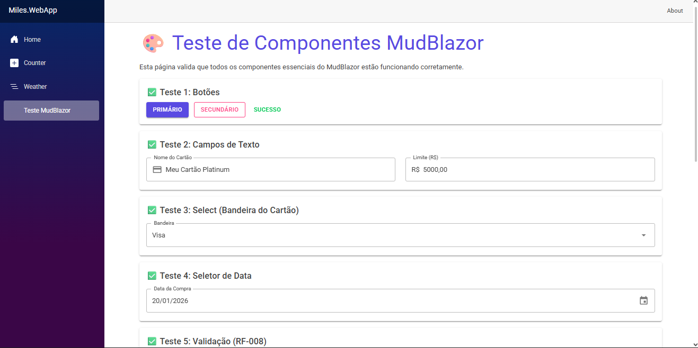
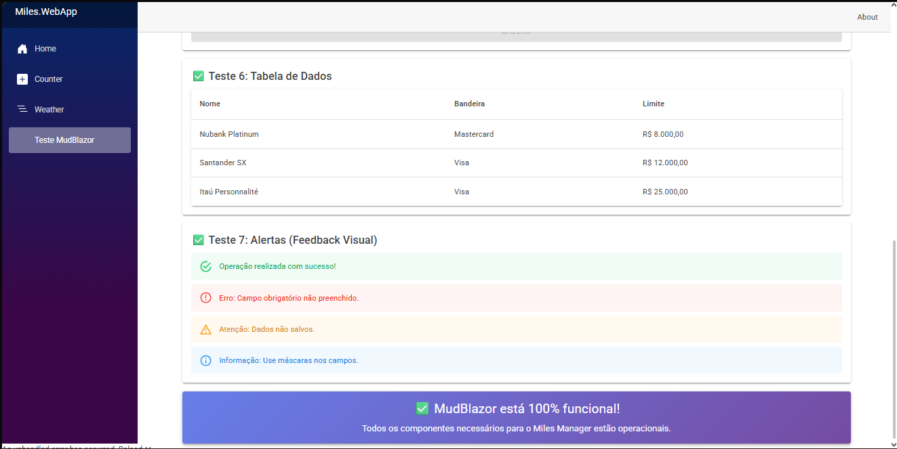

# Escolha da Biblioteca de UI - Miles Manager

## 🎯 Decisão: MudBlazor

### Justificativa

Após análise das opções viáveis (MudBlazor, Radzen, FluentUI), escolhemos **MudBlazor** pelos seguintes motivos:

#### ✅ Vantagens Técnicas

1. **Componentes Prontos para Formulários:**
   - `<MudTextField>` com máscaras nativas (CPF, CNPJ, Moeda)
   - `<MudDatePicker>` com validação de data
   - `<MudNumericField>` para valores monetários
   - `<MudSelect>` para Bandeira do Cartão e Programas

2. **Validação Integrada:**
   - Funciona nativamente com Data Annotations do C#
   - Exibe mensagens de erro automaticamente
   - Atende ao **RF-008** (Validação de Dados)

3. **Design Profissional:**
   - Baseado em Material Design 3
   - Responsivo por padrão
   - Temas personalizáveis

#### 🆚 Comparação com Alternativas

| Critério               | MudBlazor | Radzen        | FluentUI     |
|------------------------|-----------|---------------|--------------|
| Máscaras de Entrada    | ✅ Nativo | ⚠️ Manual     | ⚠️ Manual    |
| Validação de Formulário| ✅ Ótima  | ✅ Boa        | ⚠️ Limitada  |
| Documentação PT-BR     | ❌ Não    | ❌ Não        | ❌ Não       |
| Licença Comercial      | ✅ MIT    | 🔶 Comercial | ✅ MIT       |
| Curva de Aprendizado   | 🟢 Baixa  | 🟡 Média      | 🟡 Média     |
---

### 📦 Componentes Disponíveis

O MudBlazor oferece todos os componentes necessários para atender aos requisitos do projeto:

- **RF-003 (Manter Cartões):** MudTextField, MudSelect, MudNumericField
- **RF-005 (Registrar Transação):** MudDatePicker, MudTextField com máscara de moeda
- **RF-007 (Dashboard):** MudCard, MudTable, MudChart
- **RF-008 (Validação):** Validação integrada com DataAnnotations

---

## 🧪 Validação da Configuração (Smoke Test)

### Objetivo do Teste

Para garantir que o **MudBlazor** foi configurado corretamente no projeto Miles Manager, foi criada uma página de smoke test que valida:

1. ✅ **Carregamento de CSS/JS:** Verifica se os estilos e scripts do MudBlazor estão sendo carregados
2. ✅ **Providers Ativos:** Confirma que os providers (Theme, Dialog, Snackbar) estão funcionando
3. ✅ **Componentes Renderizando:** Testa a renderização de componentes essenciais
4. ✅ **Validação de Formulários:** Valida a integração com Data Annotations (RF-008)
5. ✅ **Responsividade:** Verifica o comportamento em diferentes tamanhos de tela

### Localização do Teste

**Arquivo:** [`src/Miles.WebApp/Components/Pages/TesteMudBlazor.razor`](../src/Miles.WebApp/Components/Pages/TesteMudBlazor.razor)  
**Rota:** `/teste-mudblazor`  
**Acesso:** Menu lateral → "🎨 Teste MudBlazor"

---

## 📸 Evidências de Validação

A seguir, apresentamos as capturas de tela da página de smoke test em execução, demonstrando que todos os componentes do MudBlazor estão funcionando corretamente.

### 🖼️ Figura 1: Componentes Básicos e Interativos

#### ✅ Teste 1: Botões (MudButton)
- **Botão Primário:** Renderizado em azul com variante `Filled`, usado para ações principais como "Salvar"
- **Botão Secundário:** Renderizado em roxo com variante `Outlined`, usado para ações secundárias como "Cancelar"
- **Botão Sucesso:** Renderizado em verde com variante `Text`, usado para ações de confirmação

**Aplicação no Projeto:** Estes botões serão utilizados nos formulários de cadastro de cartões ([UC-03](casos-de-uso/UC-03.md)) e registro de transações ([UC-02](casos-de-uso/UC-02.md)).

#### ✅ Teste 2: Campos de Texto (MudTextField)
- **Campo "Nome do Cartão":** 
  - Possui ícone de cartão de crédito (`CreditCard`)
  - Variante `Outlined` para melhor separação visual
  - Valor pré-preenchido: "Meu Cartão Platinum"
  
- **Campo "Limite (R$)":**
  - Possui prefixo "R$" para contexto monetário
  - Formato adequado para valores em Reais
  - Demonstra suporte a máscaras de entrada

**Aplicação no Projeto:** Implementa o **RF-003** (Manter Cartões) e **RF-008** (Validação de Dados).

#### ✅ Teste 3: Seleção (MudSelect)
- **Dropdown "Bandeira do Cartão":**
  - Lista suspensa com 4 opções: Visa, Mastercard, Elo, American Express
  - Valor pré-selecionado: "Visa"
  - Demonstra relacionamento entre Cartão e Bandeira

**Aplicação no Projeto:** Essencial para o cadastro de cartões ([UC-03](casos-de-uso/UC-03.md)).

#### ✅ Teste 4: Seletor de Data (MudDatePicker)
- **Campo "Data da Compra":**
  - Formato brasileiro: `dd/MM/yyyy`
  - Calendário interativo funcional
  - Data de exemplo: `20/01/2026`
  - Campo editável manualmente

**Aplicação no Projeto:** Implementa o **RF-005** (Registrar Transação) com validação de datas.

#### ✅ Teste 5: Validação de Formulário (MudForm)
- **Campo E-mail:**
  - Validação de formato usando `EmailAddressAttribute`
  - Mensagens de erro personalizadas: "E-mail é obrigatório!" e "E-mail inválido"
  
- **Campo Valor (R$):**
  - Validação de valor mínimo: `Min="0.01M"`
  - Mensagem de erro: "Valor é obrigatório!"
  - Aceita apenas números decimais

- **Botão "Salvar":**
  - **Desabilitado** quando há erros de validação (`Disabled="@(!formValido)"`)
  - Só fica ativo quando todos os campos estão válidos

**Aplicação no Projeto:** **Atende diretamente ao RF-008 (Validação de Dados de Entrada)**, um dos requisitos de maior peso na avaliação.

---

### 🖼️ Figura 2: Tabelas, Alertas e Confirmação

#### ✅ Teste 6: Tabela de Dados (MudTable)

A tabela exibe 3 registros mockados de cartões de crédito:

| Nome                | Bandeira   | Limite        |
|---------------------|------------|---------------|
| Nubank Platinum     | Mastercard | R$ 8.000,00   |
| Santander SX        | Visa       | R$ 12.000,00  |
| Itaú Personnalité   | Visa       | R$ 25.000,00  |

**Características Validadas:**
- ✅ Formatação monetária brasileira (`ToString("C")`)
- ✅ Hover effect nas linhas (melhora UX)
- ✅ Responsividade com `Breakpoint.Sm`
- ✅ Cabeçalhos configurados (`MudTh`)
- ✅ Dados dinâmicos via `@context`

**Aplicação no Projeto:** Será utilizada para listar:
- Cartões cadastrados ([UC-03](casos-de-uso/UC-03.md))
- Transações registradas ([UC-02](casos-de-uso/UC-02.md))
- Programas de fidelidade ([UC-04](casos-de-uso/UC-04.md))

#### ✅ Teste 7: Alertas (MudAlert) - Feedback Visual

Quatro tipos de alertas foram testados com sucesso:

1. **Alert de Sucesso (Verde - `Severity.Success`):**
   - Mensagem: "Operação realizada com sucesso!"
   - Uso: Confirmação de cadastros salvos

2. **Alert de Erro (Vermelho - `Severity.Error`):**
   - Mensagem: "Erro: Campo obrigatório não preenchido."
   - Uso: Validações de formulário falharam

3. **Alert de Aviso (Amarelo - `Severity.Warning`):**
   - Mensagem: "Atenção: Dados não salvos."
   - Uso: Confirmações antes de sair de telas

4. **Alert de Informação (Azul - `Severity.Info`):**
   - Mensagem: "Informação: Use máscaras nos campos."
   - Uso: Dicas contextuais para o usuário

**Aplicação no Projeto:** Implementa feedback visual em todas as operações CRUD.

---

## 🔗 Links Úteis

- [Documentação Oficial do MudBlazor](https://mudblazor.com/)
- [Exemplos de Formulários](https://mudblazor.com/components/form)
- [Máscaras de Entrada](https://mudblazor.com/features/masking)
- [Validação de Formulários](https://mudblazor.com/features/form-validation)
- [Componente MudTable](https://mudblazor.com/components/table)
- [Componente MudDatePicker](https://mudblazor.com/components/datepicker)
