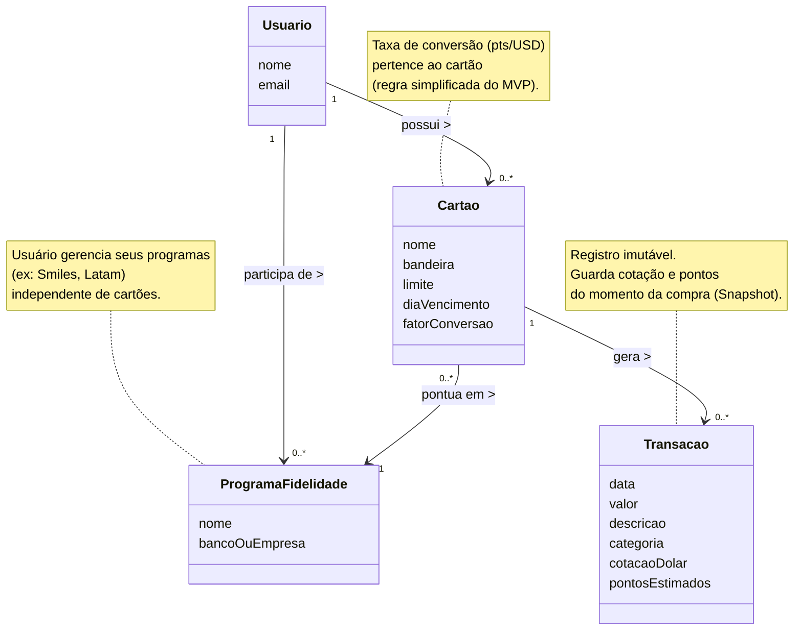

### Diagrama Conceitual

O Diagrama Conceitual ilustra os conceitos fundamentais do domínio do problema sob a ótica do analista de negócios. Em conformidade com as melhores práticas de Análise Orientada a Objetos (AOO), este artefato representa "coisas do mundo real" e não componentes de software, servindo como um vocabulário comum para alinhar o entendimento entre desenvolvedores e _stakeholders_.

Diferentemente do Diagrama de Classes de Projeto — que será apresentado posteriormente detalhando a arquitetura, padrões de projeto e implementação em C# —, o foco desta etapa é garantir a integridade das regras de negócio, a correta persistência dos dados financeiros e a definição das relações entre os conceitos, abstraindo-se de detalhes tecnológicos como autenticação ou banco de dados.

A Figura apresenta o diagrama conceitual modelado para o sistema _Miles Manager_.

 Diagrama Conceitual do Sistema Miles Manager

#### Decisões de Modelagem e Abstração

Para atender aos requisitos funcionais e não funcionais descritos no estudo de caso, bem como respeitar as diretrizes teóricas de modelagem conceitual, foram adotadas as seguintes decisões estruturais sobre as entidades:

**1. Abstração de Implementação (Entidade Usuario)**
Na entidade `Usuario`, optou-se por modelar estritamente os atributos que identificam a pessoa no domínio do problema (`nome` e `email`).

- _Justificativa:_ Atributos como `senha`, `token` ou `salt` foram deliberadamente omitidos nesta etapa. Conforme a teoria de Análise Orientada a Objetos (AOO), a senha é um mecanismo de segurança da solução de software e não uma característica intrínseca do conceito de "Usuário" no mundo real.

**2. Auditoria e Imutabilidade (Entidade Transacao)**
A entidade `Transacao` foi projetada para funcionar como um _"snapshot"_ (retrato) do momento da compra, incluindo os atributos `cotacaoDolar` e `pontosEstimados`.

- _Justificativa:_ Essa decisão garante a auditabilidade do sistema. Mesmo que a cotação do dólar varie ou a regra do cartão mude, o registro histórico preserva os valores originais, assegurando a consistência financeira.

**3. Simplificação da Regra de Negócio (Entidade Cartao)**
O atributo `fatorConversao` foi alocado diretamente na entidade `Cartao`.

- _Justificativa:_ Para o escopo deste MVP, assume-se que cada cartão possui uma regra de pontuação fixa. Essa abordagem evita a complexidade de tabelas de regras dinâmicas sem comprometer a precisão dos cálculos.

**4. Cálculo sob Demanda (Ausência de Saldo)**
Não foi incluído um atributo de "Saldo Total" nas entidades persistentes.

- _Justificativa:_ O saldo deve ser uma informação derivada do somatório das transações válidas. Isso evita o problema de "furo de caixa" (inconsistência entre valor armazenado e histórico real).

#### Análise dos Relacionamentos (Associações)

A estrutura de relacionamentos do diagrama reflete as interações do mundo real entre os conceitos. Abaixo, detalham-se as conexões de cada entidade principal:

**A. Cartão (3 Relacionamentos)**
O Cartão atua como o elemento conector do sistema, possuindo três vínculos essenciais:

1. **Com Usuário (Posse):** Todo cartão pertence obrigatoriamente a um titular (`1 Usuario`).
2. **Com Programa (Pontuação):** Todo cartão deve saber para onde enviar os pontos gerados. Ele se vincula a `1 ProgramaFidelidade` (representando parcerias ou cartões _co-branded_).
3. **Com Transação (Geração):** O cartão é a origem dos eventos financeiros, podendo gerar `0..* Transações` ao longo de sua vida útil.

**B. Usuário (2 Relacionamentos)**
O Usuário é o centro da gestão e possui duas conexões de propriedade direta:

1. **Com Cartão (Instrumento):** O usuário possui `0..* Cartões` de crédito para uso.
2. **Com Programa (Ativo):** O usuário mantém cadastro em `0..* Programas de Fidelidade` (ex: Smiles, Latam Pass).

- _Nota:_ Este vínculo direto é crucial pois permite ao usuário gerenciar seus programas mesmo que ainda não tenha cartões vinculados a eles.

**C. Programa de Fidelidade (2 Relacionamentos)**
O Programa atua como o destino dos pontos e se relaciona de duas formas:

1. **Com Usuário (Participação):** O programa tem `1 Usuário` titular da conta.
2. **Com Cartão (Fonte):** O programa recebe pontos de `0..* Cartões` que estejam configurados para pontuar nele.

**D. Transação (1 Relacionamento)**
A Transação é a entidade mais dependente do modelo (evento):

1. **Com Cartão (Origem):** Uma transação não existe por conta própria; ela é gerada exclusivamente por `1 Cartão`. Isso estabelece uma dependência forte, onde o histórico de compras está intrinsecamente ligado ao instrumento utilizado.
