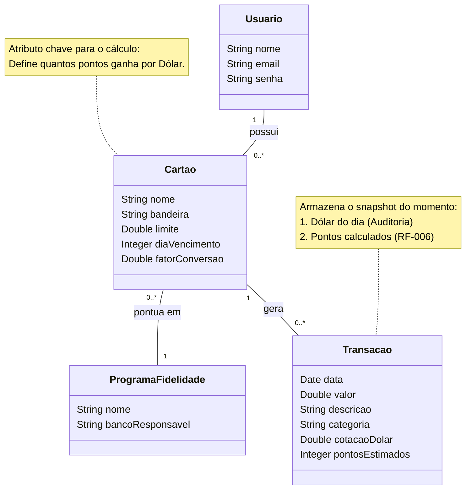

### Diagrama Conceitual

O Diagrama Conceitual ilustra os conceitos fundamentais do domínio do problema sob a ótica do analista de negócios. Conforme as melhores práticas de Análise Orientada a Objetos, este diagrama representa "coisas do mundo real" e não componentes de software, servindo como um vocabulário comum para alinhar o entendimento entre desenvolvedores e stakeholders.

Diferentemente do Diagrama de Classes de Projeto — que detalhará a arquitetura, padrões de projeto e métodos específicos da implementação em C# —, o foco desta etapa é garantir a integridade das regras de negócio e a persistência correta dos dados financeiros.

Abaixo, apresenta-se o diagrama modelado para o sistema **Miles Manager**:

#### Análise das Entidades e Decisões de Modelagem

Para atender aos requisitos de integridade financeira e cálculo automático (RF-006) descritos no estudo de caso, as seguintes decisões estruturais foram tomadas neste modelo:

1. **Auditoria e Imutabilidade (Entidade Transacao):**
   A entidade `Transacao` foi projetada para armazenar um "snapshot" (retrato) do momento da compra. Incluiu-se o atributo `cotacaoDolar` além do `pontosEstimados`.
   - _Justificativa:_ Isso garante a auditabilidade do sistema. Mesmo que a cotação do dólar varie ou a regra do cartão mude no futuro, o registro histórico da transação preserva os valores originais utilizados no cálculo, garantindo a consistência dos dados.

2. **Simplificação da Regra de Negócio (Entidade Cartao):**
   O atributo `fatorConversao` foi alocado diretamente na entidade `Cartao`.
   - _Justificativa:_ Para o escopo deste MVP, assume-se que cada cartão possui uma regra de pontuação fixa (ex: 2.0 pontos por dólar). Essa abordagem reduz a complexidade inicial, evitando a criação de tabelas abstratas de regras, sem ferir os requisitos funcionais.

3. **Cálculo sob Demanda (Ausência de atributo 'Saldo'):**
   Não foi incluído um atributo de "Saldo Total" nas entidades `Usuario` ou `ProgramaFidelidade`.
   - _Justificativa:_ Em sistemas financeiros robustos, o saldo deve ser derivado do somatório das transações (cálculo em tempo de execução) para evitar inconsistências entre o valor armazenado e o histórico real de movimentações. O Dashboard (RF-007) será responsável por realizar essa agregação na camada de aplicação.

4. **Relacionamentos:**

- Um **Usuario** é o detentor central dos dados.
- O **Cartao** atua como o gerador de pontos e está vinculado a um único **ProgramaFidelidade** (ex: um cartão _co-branded_ que pontua diretamente na companhia aérea).
- A **Transacao** é o evento financeiro atômico gerado pelo uso do cartão.
