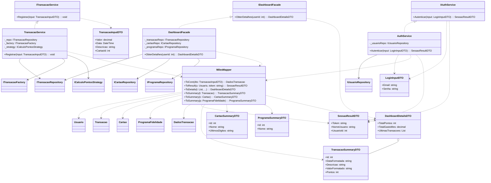

### Camada de Aplicação (Application Services)

A camada de Aplicação (`Miles.Application`) atua como a orquestradora dos fluxos de trabalho do sistema. Ela serve como fronteira entre a interface do usuário (WebApp) e o núcleo do domínio (Core). Sua responsabilidade não é aplicar regras de negócio fundamentais — que residem nas Entidades —, mas sim coordenar a recepção de dados, a invocação de comportamentos do domínio e a persistência através de contratos.

O diagrama a seguir (Figura) apresenta a estrutura detalhada desta camada, evidenciando o uso de padrões para garantir desacoplamento e segurança.

Figura: Diagrama de Classes da Camada de Aplicação

#### Decisões Arquiteturais e Padrões de Projeto

A modelagem da camada de aplicação foi guiada por princípios de _Clean Architecture_ e _Separation of Concerns_ (Separação de Preocupações). Abaixo, detalham-se os principais componentes representados no diagrama:

**1. Estratégia de DTOs Semânticos (Data Transfer Objects)**
Para evitar o acoplamento direto entre a interface e o banco de dados, bem como proteger dados sensíveis, adotou-se uma segregação estrita dos objetos de transferência:

- **Inputs (Escrita):** Classes com sufixo `InputDTO` (ex: `LoginInputDTO`, `TransacaoInputDTO`) contêm apenas os dados necessários para realizar uma operação. Elas representam a intenção do usuário.
- **Summaries/Results (Leitura):** Classes com sufixo `SummaryDTO` ou `ResultDTO` (ex: `TransacaoSummaryDTO`) são otimizadas para visualização. Elas entregam dados já formatados (ex: datas em _string_, valores monetários) e ocultam a estrutura interna das entidades.
- **Agregadores (Dashboard):** O `DashboardDetailsDTO` é um objeto composto que agrupa totais e listas, permitindo que a tela inicial seja carregada com uma única requisição de rede.

**2. Interfaces e Injeção de Dependência (DI)**
O sistema segue o princípio de "Programar para Interfaces" (_Program to an Interface_).

- A camada de apresentação (`WebApp`) depende exclusivamente das interfaces (`ITransacaoService`, `IAuthService`), desconhecendo as implementações concretas.
- As classes de serviço (`TransacaoService`, etc.) não instanciam suas dependências (Repositórios e Factories). Em vez disso, elas declaram essas dependências como campos privados (ex: `_repo`, `_factory`) que são recebidos via construtor. Isso permite que o contêiner de Injeção de Dependência do ASP.NET Core gerencie o ciclo de vida dos objetos e facilita a criação de testes unitários com _mocks_.

**3. Pattern Facade (Fachada de Leitura)**
Para atender ao **RF-007 (Dashboard)** de forma performática, implementou-se a classe `DashboardFacade`.

- Diferente de um serviço tradicional que foca em um domínio, esta Fachada orquestra chamadas a múltiplos repositórios (`Transacao`, `Cartao`, `Programa`) para consolidar as informações financeiras e estatísticas em um único objeto de retorno (`DashboardDetailsDTO`), reduzindo a complexidade no _frontend_.

**4. Pattern Mapper (Centralização de Conversão)**
A classe estática `MilesMapper` isola a lógica de transformação de objetos.

- Ela atua como um "tradutor" centralizado, convertendo `Inputs` em Objetos de Domínio (para o Core processar) e Entidades em `DTOs` (para a Tela exibir). Isso evita que os Serviços fiquem poluídos com código repetitivo de atribuição de propriedades e garante que as Entidades do Core permaneçam puras, sem dependências da camada de Aplicação.
