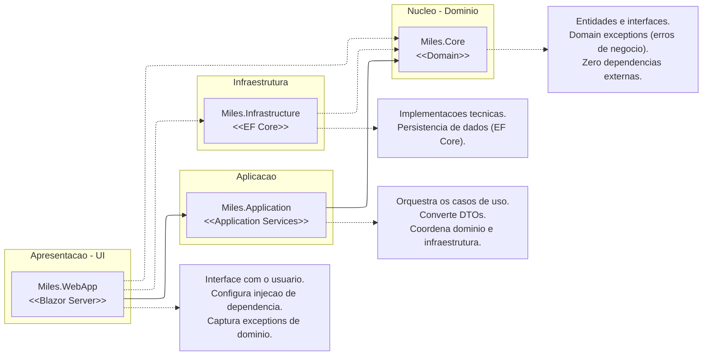

### Visão Arquitetural (Pacotes)

O diagrama de pacotes a seguir apresenta a estrutura macro da solução. Ele ilustra como os projetos foram organizados e como se relacionam através do princípio da Inversão de Dependência, destacando o fluxo de tratamento de erros e referências

O diagrama acima demonstra o isolamento do Core e a direção das dependências, que sempre apontam para o centro (camadas mais internas). A responsabilidade de cada pacote foi definida da seguinte forma:

- **Miles.Core (Núcleo):** O centro da arquitetura. Contém as Entidades, Value Objects, Interfaces de Repositório e as **Exceptions de Domínio** (ex: `SaldoInsuficienteException`). É um pacote puro, garantindo que as regras de negócio e os tipos de erros sejam universais dentro da solução.
- **Miles.Application (Aplicação):** Responsável pela orquestração. Esta camada consome as entidades do Core para executar a lógica dos casos de uso. Caso uma regra de negócio seja violada no Core, a exceção atravessa esta camada e sobe para a apresentação.
- **Miles.Infrastructure (Infraestrutura):** Encarregada dos detalhes técnicos. Implementa as interfaces definidas no Core, garantindo a persistência via Entity Framework. A infraestrutura depende do Core para conhecer os contratos que deve cumprir.
- **Miles.WebApp (Apresentação):** O ponto de entrada (Blazor Server). Este projeto referencia a _Application_ para chamar os serviços e a _Infrastructure_ para configurar a Injeção de Dependência. Além disso, mantém uma referência ao _Core_ estritamente para ter acesso às **Exceptions de Domínio** e **Enums**, permitindo que a interface capture erros de negócio específicos (`try/catch`) e exiba feedbacks adequados ao usuário final.
