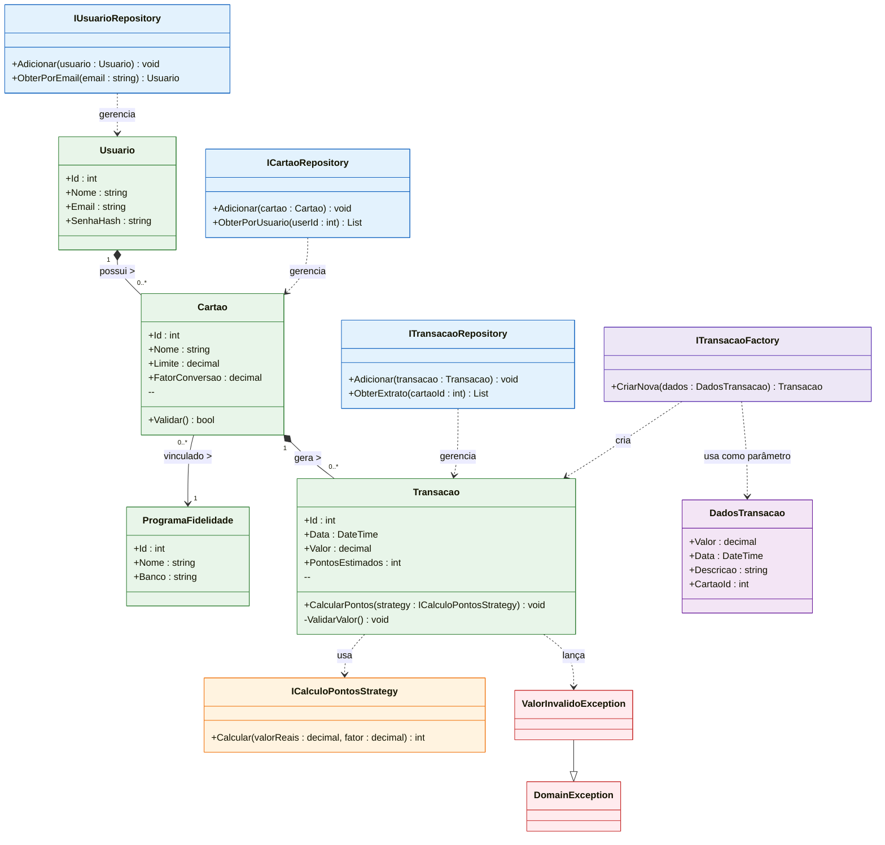

### Modelagem do Domínio (Core)

A camada de Domínio, representada pelo projeto `Miles.Core`, encapsula as regras de negócio fundamentais. O diagrama a seguir foca nas Entidades persistentes e nos Contratos (Interfaces) que garantem o desacoplamento, isolando o domínio de detalhes de infraestrutura.

**Organização Lógica (Namespaces)**
Embora o diagrama abaixo apresente uma visão unificada das classes para facilitar a leitura e compreensão dos relacionamentos, vale ressaltar que o projeto `Miles.Core` está estruturado internamente em _namespaces_ distintos para separar responsabilidades:

- **Entities:** Contém as classes persistentes (`Usuario`, `Cartao`, `Transacao` e `ProgramaFidelidade`).
- **Interfaces:** Contém os contratos de repositórios, _factories_ e _strategies_.
- **Exceptions:** Contém as exceções personalizadas de domínio.

#### Diagrama de Classes de Domínio

O diagrama explicita as dependências entre os contratos de repositório e as entidades de negócio, bem como a aplicação de padrões de projeto.

#### Explicação Técnica e Decisões de Design

O diagrama de classes da camada de Domínio (`Miles.Core`) não apenas representa a estrutura de dados, mas materializa as regras de negócio e garante a qualidade arquitetural do sistema. A modelagem apresentada resolve requisitos críticos através das seguintes decisões de design:

**1. Inversão de Dependência e Contratos de Repositório**
A definição das interfaces (`IUsuarioRepository`, `ICartaoRepository`, etc.) dentro do Domínio estabelece que as regras de persistência são ditadas pelo negócio, e não pelo banco de dados.

- **Decisão:** As interfaces dependem explicitamente das Entidades (ex: `Adicionar(usuario: Usuario)`).
- **Benefício:** Isso obriga a camada de Infraestrutura a retornar objetos de negócio válidos e encapsulados, impedindo que "tabelas de banco" ou dados inconsistentes vazem para dentro da aplicação.

**2. Domínio Rico e Tratamento de Exceções (Reliability)**
Para evitar o anti-padrão de "Modelo Anêmico", as entidades possuem métodos de validação comportamental (ex: `ValidarValor()`).

- **Decisão:** A relação de dependência `Transacao ..> ValorInvalidoException` documenta que a validação ocorre _antes_ da persistência.
- **Benefício:** O sistema não espera um erro de banco de dados para falhar. Ele valida regras de negócio (como valores negativos ou nulos) proativamente, lançando exceções tipadas que permitem à interface apresentar feedbacks precisos ao usuário.

**3. Aplicação de Design Patterns (Padrões de Projeto)**
Foram aplicados padrões clássicos (GoF) para resolver problemas de complexidade e extensibilidade:

- **Strategy Pattern (Princípio Open/Closed):** A lógica de conversão de pontos foi delegada à interface `ICalculoPontosStrategy`. Isso permite injetar diferentes algoritmos (Cálculo Nacional vs. Internacional) sem a necessidade de modificar a classe `Transacao`, facilitando a manutenção e testes unitários.
- **Factory Pattern:** A interface `ITransacaoFactory` abstrai a complexidade da criação de objetos, garantindo que uma `Transacao` sempre nasça em um estado válido.
- **Parameter Object (Value Object):** O uso da classe `DadosTransacao` na Factory evita o _code smell_ de "Long Parameter List" (métodos com muitos argumentos), tornando a assinatura do método mais limpa e permitindo a adição de novos campos no futuro sem quebrar o contrato da interface.

**4. Modelagem de Relacionamentos e Requisitos (RF-004 e RF-007)**
Uma decisão crítica de modelagem foi desvincular o `ProgramaFidelidade` da dependência exclusiva do `Cartao`.

- **Decisão:** Estabeleceu-se a relação `Usuario "1" *-- "0..*" ProgramaFidelidade`, suportada pela interface `IProgramaRepository`.
- **Benefício:** Isso atende ao requisito de listar "Meus Programas" no Dashboard independentemente de o usuário possuir cartões vinculados, além de refletir a realidade do negócio onde um mesmo programa (ex: Smiles) pode estar associado a múltiplos cartões de bancos diferentes.
