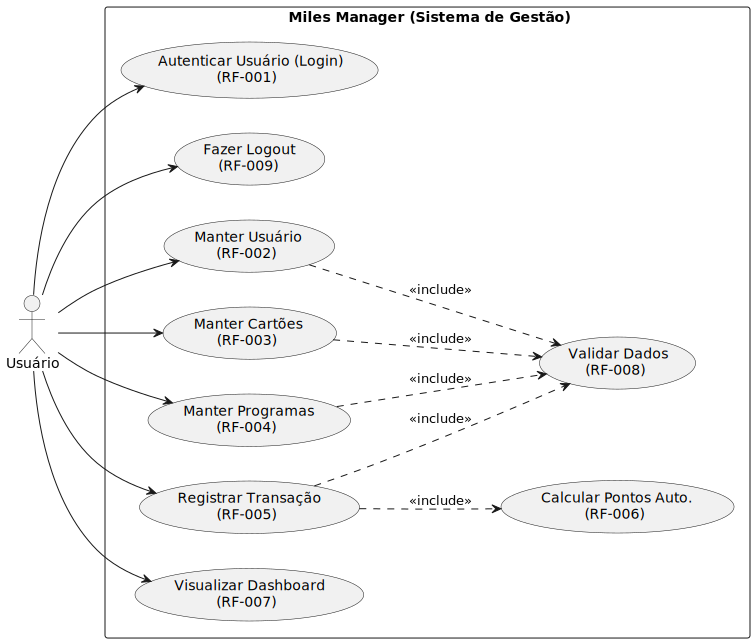
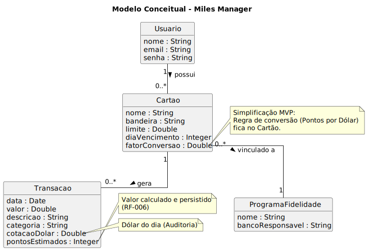
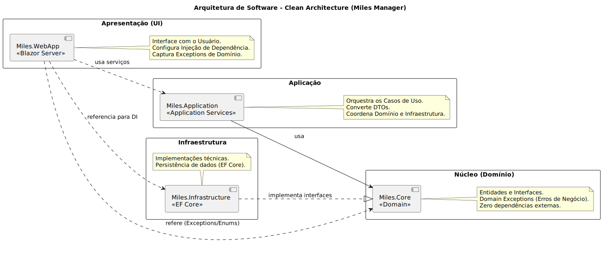
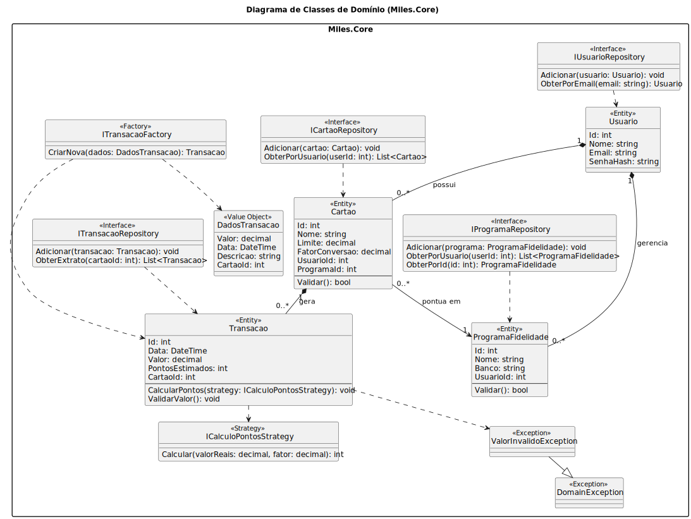
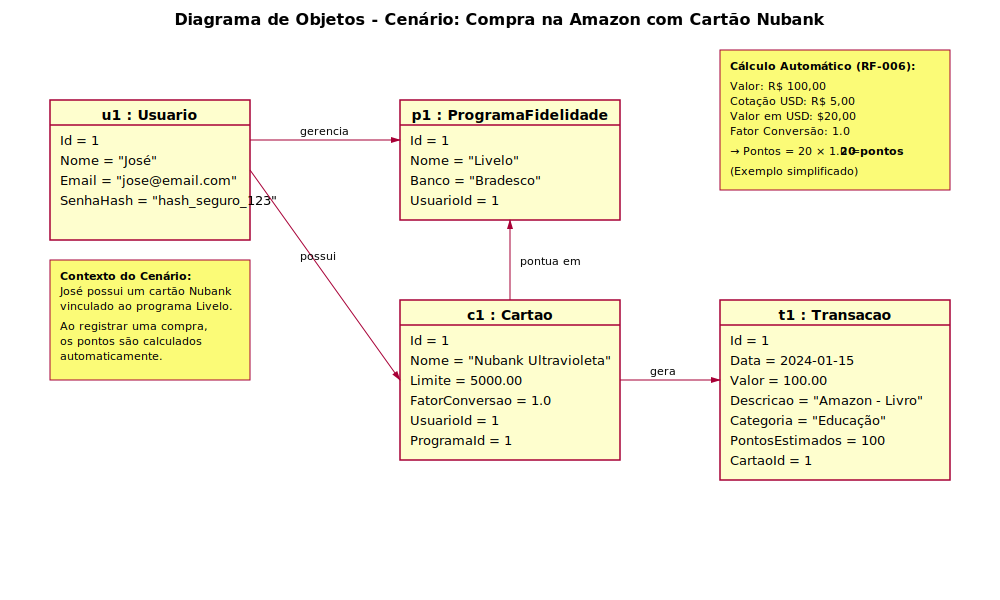
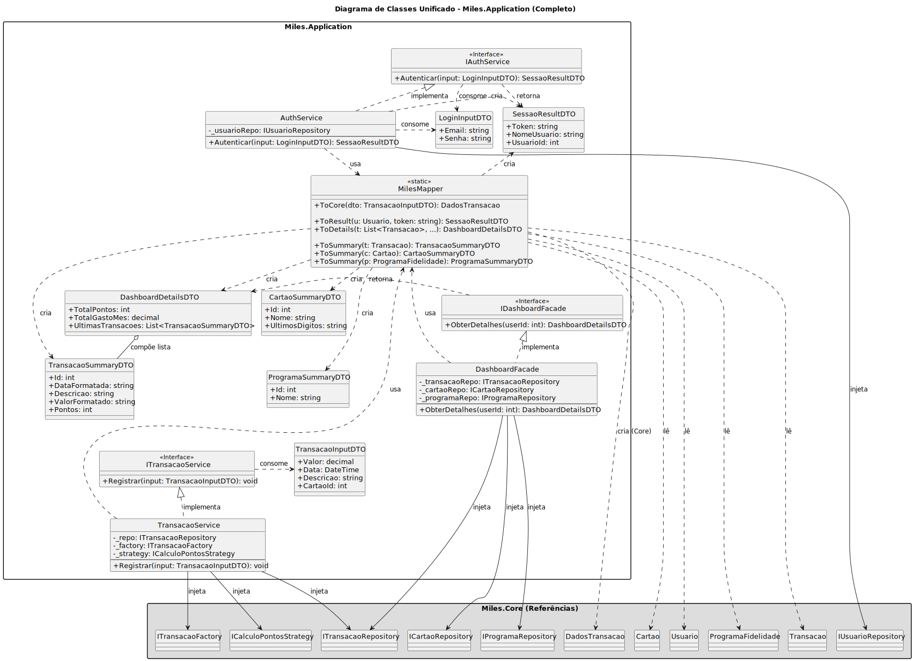

# Modelagem UML

Esta seção apresenta os diagramas da **Unified Modeling Language (UML)** desenvolvidos para o projeto.

## Diagrama de Casos de Uso

O diagrama de casos de uso ilustra as interações entre os atores e o sistema, refletindo o escopo funcional definido anteriormente.



<details><summary>Mostrar código PlantUML</summary>

```UML
@startuml
left to right direction
skinparam packageStyle rectangle

' Definição do Ator conforme documento
actor "Usuário" as U

package "Miles Manager (Sistema de Gestão)" {
    ' Autenticação e Segurança
    usecase "Autenticar Usuário (Login)\n(RF-001)" as RF001
    usecase "Fazer Logout\n(RF-009)" as RF009

    ' CRUDs (Manter)
    usecase "Manter Usuário\n(RF-002)" as RF002
    usecase "Manter Cartões\n(RF-003)" as RF003
    usecase "Manter Programas\n(RF-004)" as RF004

    ' Processos de Negócio
    usecase "Registrar Transação\n(RF-005)" as RF005
    usecase "Visualizar Dashboard\n(RF-007)" as RF007

    ' Funcionalidades Internas (Reutilizáveis)
    usecase "Calcular Pontos Auto.\n(RF-006)" as RF006
    usecase "Validar Dados\n(RF-008)" as RF008
}

' Interações do Ator (Usuário inicia estes processos)
U --> RF001
U --> RF009
U --> RF002
U --> RF003
U --> RF004
U --> RF005
U --> RF007

' Relacionamentos de Inclusão (Obrigatórios)
' O cálculo é parte obrigatória do registro da transação [RF-006]
RF005 ..> RF006 : <<include>>

' A validação é obrigatória em todos os formulários [RF-008]
RF002 ..> RF008 : <<include>>
RF003 ..> RF008 : <<include>>
RF004 ..> RF008 : <<include>>
RF005 ..> RF008 : <<include>>

@enduml
```

</details><br/>

A modelagem adotou as seguintes definições para a representação visual:

### Ator Principal (Primary Actor)

O **Usuário** é representado como o único ator do sistema.
Conforme a identificação de atores, ele é o responsável por alimentar a base de dados (transações e programas) e iniciar todos os fluxos de eventos presentes nos requisitos **RF-001** a **RF-009**.

#### Exclusão de Atores Secundários

O diagrama **não apresenta atores secundários** (como sistemas externos de envio de e-mail ou timers).
[cite_start]Esta decisão de modelagem deve-se à remoção de funcionalidades de automação passiva, como _“Notificações Push”_, do escopo deste **MVP**[cite: 55].
Dessa forma, não há interações ativas que justifiquem a representação de outros atores além do usuário final.

## Especificação de Casos de Uso (Fluxos de Eventos)

A seguir são detalhados os fluxos de interação para os casos de uso críticos do sistema, descrevendo o comportamento esperado nos cenários de sucesso (Caminho Feliz) e exceção.

### Especificação de Caso de Uso: Autenticar Usuário (Login)

**[CLIQUE AQUI PARA VER O UC-01](casos-de-uso/UC-01.md)**

### Especificação de Caso de Uso: Registrar Transação

**[CLIQUE AQUI PARA VER O UC-02](casos-de-uso/UC-02.md)**

### Especificação de Caso de Uso: Manter Cartões

**[CLIQUE AQUI PARA VER O UC-03](casos-de-uso/UC-03.md)**

### Especificação de Caso de Uso: Manter Programas

**[CLIQUE AQUI PARA VER O UC-04](casos-de-uso/UC-04.md)**

### Especificação de Caso de Uso: Manter Usuário (Perfil)

**[CLIQUE AQUI PARA VER O UC-05](casos-de-uso/UC-05.md)**

### Especificação de Caso de Uso: Visualizar Dashboard

**[CLIQUE AQUI PARA VER O UC-06](casos-de-uso/UC-06.md)**

### Especificação de Caso de Uso: Fazer Logout

**[CLIQUE AQUI PARA VER O UC-07](casos-de-uso/UC-07.md)**

### Casos de Uso Internos (Regras de Negócio)

_Estes casos descrevem processos internos reutilizáveis (Includes)._

**[CLIQUE AQUI PARA VER O UC-08 (Validar Dados)](casos-de-uso/UC-08.md)**
**[CLIQUE AQUI PARA VER O UC-09 (Calcular Pontos)](casos-de-uso/UC-09.md)**

## Diagrama Conceitual

O Diagrama Conceitual ilustra os conceitos fundamentais do domínio do problema sob a ótica do analista de negócios.



<details><summary>Mostrar código PlantUML</summary>

```UML
@startuml

' Configurações visuais para parecer um Modelo Conceitual (sem ícones de visibilidade ou métodos)
hide methods
hide circle
skinparam classAttributeIconSize 0
skinparam linetype ortho

title Modelo Conceitual - Miles Manager

class Usuario {
    nome : String
    email : String
    senha : String
}

class Cartao {
    nome : String
    bandeira : String
    limite : Double
    diaVencimento : Integer
    fatorConversao : Double
}

class ProgramaFidelidade {
    nome : String
    bancoResponsavel : String
}

class Transacao {
    data : Date
    valor : Double
    descricao : String
    categoria : String
    cotacaoDolar : Double
    pontosEstimados : Integer
}

' Relacionamentos (Associações)

' 1 Usuário possui N Cartões
Usuario "1" -- "0..*" Cartao : possui >

' 1 Cartão pertence a 1 Programa de Fidelidade (considerando que o cartão pontua em um programa específico)
Cartao "0..*" -- "1" ProgramaFidelidade : vinculado a >

' 1 Cartão possui N Transações
Cartao "1" -- "0..*" Transacao : gera >

note right of Cartao::fatorConversao
  Simplificação MVP:
  Regra de conversão (Pontos por Dólar)
  fica no Cartão.
end note

note right of Transacao::pontosEstimados
  Valor calculado e persistido
  (RF-006)
end note

note right of Transacao::cotacaoDolar
  Dólar do dia (Auditoria)
end note

@enduml
```

</details><br/>

Aqui está o texto formatado em markdown conforme sua solicitação, sem o uso de marcadores numéricos.

## Diagrama de Classes e Arquitetura

Para atender aos requisitos de qualidade de software, testabilidade e manutenibilidade, o desenvolvimento do sistema Miles Manager adotou o padrão arquitetural **Clean Architecture** (Arquitetura Limpa). Essa escolha estratégica visa desacoplar as regras de negócio das tecnologias externas, como banco de dados e interfaces de usuário.

Diferente de arquiteturas tradicionais em camadas, onde o domínio muitas vezes depende da infraestrutura, aqui o **Domínio (Core)** é posicionado no centro do design. Isso garante que as regras vitais do negócio não sejam afetadas por mudanças em frameworks ou bibliotecas, assegurando a longevidade e a integridade do software.

### Visão Arquitetural (Pacotes)

O diagrama de pacotes a seguir apresenta a "foto aérea" da solução, ilustrando como os projetos foram organizados e como se relacionam através do princípio da Inversão de Dependência.



<details><summary>Mostrar código PlantUML</summary>

```UML

@startuml
skinparam packageStyle rectangle
skinparam shadowing false

left to right direction

title Arquitetura de Software - Clean Architecture (Miles Manager)

package "Apresentação (UI)" {
    [Miles.WebApp\n<<Blazor Server>>] as WebApp
    note right of WebApp
      Interface com o Usuário.
      Configura Injeção de Dependência.
      Captura Exceptions de Domínio.
    end note
}

package "Aplicação" {
    [Miles.Application\n<<Application Services>>] as Application
    note right of Application
      Orquestra os Casos de Uso.
      Converte DTOs.
      Coordena Domínio e Infraestrutura.
    end note
}

package "Núcleo (Domínio)" {
    [Miles.Core\n<<Domain>>] as Core
    note right of Core
      Entidades e Interfaces.
      Domain Exceptions (Erros de Negócio).
      Zero dependências externas.
    end note
}

package "Infraestrutura" {
    [Miles.Infrastructure\n<<EF Core>>] as Infrastructure
    note bottom of Infrastructure
      Implementações técnicas.
      Persistência de dados (EF Core).
    end note
}

' Dependências
WebApp ..> Application : usa serviços
WebApp ..> Infrastructure : referencia para DI
WebApp ..> Core : refere (Exceptions/Enums)

Application --> Core : usa
Infrastructure ..|> Core : implementa interfaces

@enduml

```

</details>

### Modelagem do Domínio (Core)

A camada de Domínio, representada pelo projeto `Miles.Core`, encapsula as regras de negócio fundamentais. O diagrama a seguir foca nas Entidades persistentes e nos Contratos (Interfaces) que garantem o desacoplamento, isolando o domínio de detalhes de infraestrutura.

**Organização Lógica (Namespaces)**
Embora o diagrama abaixo apresente uma visão unificada das classes para facilitar a leitura e compreensão dos relacionamentos, vale ressaltar que o projeto `Miles.Core` está estruturado internamente em _namespaces_ distintos para separar responsabilidades:

- **Entities:** Contém as classes persistentes (`Usuario`, `Cartao`, `Transacao`).
- **Interfaces:** Contém os contratos de repositórios, _factories_ e _strategies_.
- **Exceptions:** Contém as exceções personalizadas de domínio.

#### Diagrama de Classes de Domínio

O diagrama explicita as dependências entre os contratos de repositório e as entidades de negócio, bem como a aplicação de padrões de projeto.



<details><summary>Mostrar código PlantUML</summary>

```UML
@startuml
skinparam classAttributeIconSize 0
skinparam shadowing false
hide circle
skinparam packageStyle rectangle
skinparam nodesep 20
skinparam ranksep 30
scale 0.85

title Diagrama de Classes de Domínio (Miles.Core)

package "Miles.Core" {

    ' =========================
    ' Entidades (Domínio)
    ' =========================
    class Usuario <<Entity>> {
        Id: int
        Nome: string
        Email: string
        SenhaHash: string
    }

    class ProgramaFidelidade <<Entity>> {
        Id: int
        Nome: string
        Banco: string
        UsuarioId: int
        --
        Validar(): bool
    }

    class Cartao <<Entity>> {
        Id: int
        Nome: string
        Limite: decimal
        FatorConversao: decimal
        UsuarioId: int
        ProgramaId: int
        --
        Validar(): bool
    }

    class Transacao <<Entity>> {
        Id: int
        Data: DateTime
        Valor: decimal
        PontosEstimados: int
        CartaoId: int
        --
        CalcularPontos(strategy: ICalculoPontosStrategy): void
        ValidarValor(): void
    }

    class DadosTransacao <<Value Object>> {
        Valor: decimal
        Data: DateTime
        Descricao: string
        CartaoId: int
    }

    ' =========================
    ' Interfaces (Contratos)
    ' =========================
    interface IUsuarioRepository <<Interface>> {
        Adicionar(usuario: Usuario): void
        ObterPorEmail(email: string): Usuario
    }

    interface IProgramaRepository <<Interface>> {
        Adicionar(programa: ProgramaFidelidade): void
        ObterPorUsuario(userId: int): List<ProgramaFidelidade>
        ObterPorId(id: int): ProgramaFidelidade
    }

    interface ICartaoRepository <<Interface>> {
        Adicionar(cartao: Cartao): void
        ObterPorUsuario(userId: int): List<Cartao>
    }

    interface ITransacaoRepository <<Interface>> {
        Adicionar(transacao: Transacao): void
        ObterExtrato(cartaoId: int): List<Transacao>
    }

    interface ICalculoPontosStrategy <<Strategy>> {
        Calcular(valorReais: decimal, fator: decimal): int
    }

    interface ITransacaoFactory <<Factory>> {
        CriarNova(dados: DadosTransacao): Transacao
    }

    ' =========================
    ' Exceptions de Domínio
    ' =========================
    class DomainException <<Exception>>
    class ValorInvalidoException <<Exception>>

    ValorInvalidoException --|> DomainException

    ' =========================
    ' Relacionamentos Estruturais
    ' =========================
    Usuario "1" *-- "0..*" Cartao : possui
    Usuario "1" *-- "0..*" ProgramaFidelidade : gerencia

    Cartao "0..*" --> "1" ProgramaFidelidade : pontua em
    Cartao "1" *-- "0..*" Transacao : gera

    ' =========================
    ' Dependências
    ' =========================
    IUsuarioRepository ..> Usuario
    IProgramaRepository ..> ProgramaFidelidade
    ICartaoRepository ..> Cartao
    ITransacaoRepository ..> Transacao

    Transacao ..> ICalculoPontosStrategy
    ITransacaoFactory ..> Transacao
    ITransacaoFactory ..> DadosTransacao

    Transacao ..> ValorInvalidoException

    ' =========================
    ' Força de Layout (invisível)
    ' =========================
    DomainException -[hidden]-> Usuario
    DadosTransacao -[hidden]-> Transacao
}

@enduml

```

</details>

#### Diagrama de Objetos (Snapshot)

Para validar o modelo de classes e fornecer uma referência visual de dados reais, apresentamos um **diagrama de objetos** que captura um cenário específico de uso do sistema.

**Cenário:** O usuário José utiliza seu cartão Nubank Ultravioleta (vinculado ao programa Livelo) para realizar uma compra de R$ 100,00 na Amazon, classificada como "Educação".

Este snapshot demonstra como as instâncias das entidades se relacionam em tempo de execução, servindo também como base para a criação de dados de teste (_seed data_) no banco de dados.



<details><summary>Mostrar código PlantUML</summary>

```UML
@startuml
skinparam objectAttributeIconSize 0
skinparam shadowing false
skinparam linetype ortho
scale 0.95

title Diagrama de Objetos - Cenário: Compra na Amazon com Cartão Nubank

' =========================
' Instâncias dos Objetos
' =========================

object "u1 : Usuario" as u1 {
    Id = 1
    Nome = "José"
    Email = "jose@email.com"
    SenhaHash = "hash_seguro_123"
}

object "p1 : ProgramaFidelidade" as p1 {
    Id = 1
    Nome = "Livelo"
    Banco = "Bradesco"
    UsuarioId = 1
}

object "c1 : Cartao" as c1 {
    Id = 1
    Nome = "Nubank Ultravioleta"
    Limite = 5000.00
    FatorConversao = 1.0
    UsuarioId = 1
    ProgramaId = 1
}

object "t1 : Transacao" as t1 {
    Id = 1
    Data = 2024-01-15
    Valor = 100.00
    Descricao = "Amazon - Livro"
    Categoria = "Educação"
    PontosEstimados = 100
    CartaoId = 1
}

' =========================
' Relacionamentos (Links)
' =========================

u1 --> c1 : possui
u1 --> p1 : gerencia
c1 --> p1 : pontua em
c1 --> t1 : gera

note right of t1
  **Cálculo Automático (RF-006):**
  
  Valor: R$ 100,00
  Cotação USD: R$ 5,00
  Valor em USD: $20,00
  Fator Conversão: 1.0
  
  → Pontos = 20 × 1.0 = **20 pontos**
  
  (Exemplo simplificado)
end note

note left of u1
  **Contexto do Cenário:**
  José possui um cartão Nubank
  vinculado ao programa Livelo.
  
  Ao registrar uma compra,
  os pontos são calculados
  automaticamente.
end note

@enduml
```

</details><br/>

**Observações sobre o Diagrama:**

- **Valores Realistas:** Os objetos contêm dados representativos de um caso de uso real, facilitando a compreensão do fluxo de dados.
- **Links (Associações em Runtime):** As setas indicam as referências concretas entre os objetos, refletindo as multiplicidades definidas no diagrama de classes.
- **Validação do Modelo:** Este snapshot confirma que o modelo de classes é capaz de suportar o cenário proposto, incluindo o relacionamento entre `Usuario`, `Cartao`, `ProgramaFidelidade` e `Transacao`.
- **Base para Seed Data:** Os valores apresentados podem ser utilizados diretamente na criação de dados iniciais para testes de integração e demonstração do sistema.

### Camada de Aplicação (Application Services)

A camada de Aplicação (`Miles.Application`) atua como a orquestradora dos fluxos de trabalho do sistema. Ela serve como fronteira entre a interface do usuário (WebApp) e o núcleo do domínio (Core). Sua responsabilidade não é aplicar regras de negócio fundamentais — que residem nas Entidades —, mas sim coordenar a recepção de dados, a invocação de comportamentos do domínio e a persistência através de contratos.

O diagrama a seguir (Figura) apresenta a estrutura detalhada desta camada, evidenciando o uso de padrões para garantir desacoplamento e segurança.



<details><summary>Mostrar código PlantUML</summary>

```UML

@startuml
skinparam classAttributeIconSize 0
skinparam shadowing false
hide circle
skinparam packageStyle rectangle
skinparam nodesep 20
skinparam ranksep 30
scale 0.90
skinparam class<<invisible>> {
  BorderColor transparent
  BackgroundColor transparent
  FontColor transparent
  StereotypeFontColor transparent
}

title Diagrama de Classes Unificado - Miles.Application (Completo)

' =========================================
' 1. MILES.CORE (Dependências e Entidades)
' =========================================
package "Miles.Core (Referências)" #DDDDDD {

    ' Interfaces (Contratos do Domínio)
    interface IUsuarioRepository
    interface ITransacaoRepository
    interface ICartaoRepository
    interface IProgramaRepository
    interface ITransacaoFactory
    interface ICalculoPontosStrategy

    ' Entidades e Value Objects
    class Usuario
    class Transacao
    class Cartao
    class ProgramaFidelidade
    class DadosTransacao

}

' =========================================
' 2. MILES.APPLICATION
' =========================================
package "Miles.Application" {

    ' --- 2.1. DTOs (Dados Completos) ---
    class __APP_BOTTOM_ANCHOR__ <<invisible>>
    class LoginInputDTO {
        +Email: string
        +Senha: string
    }

    class SessaoResultDTO {
        +Token: string
        +NomeUsuario: string
        +UsuarioId: int
    }

    class TransacaoInputDTO {
        +Valor: decimal
        +Data: DateTime
        +Descricao: string
        +CartaoId: int
    }

    class TransacaoSummaryDTO {
        +Id: int
        +DataFormatada: string
        +Descricao: string
        +ValorFormatado: string
        +Pontos: int
    }

    class CartaoSummaryDTO {
        +Id: int
        +Nome: string
        +UltimosDigitos: string
    }

    class ProgramaSummaryDTO {
        +Id: int
        +Nome: string
    }

    class DashboardDetailsDTO {
        +TotalPontos: int
        +TotalGastoMes: decimal
        +UltimasTransacoes: List<TransacaoSummaryDTO>
    }


    ' --- 2.2. Interfaces (Contratos do Application) ---
    interface IAuthService <<Interface>> {
        + Autenticar(input: LoginInputDTO): SessaoResultDTO
    }

    interface ITransacaoService <<Interface>> {
        + Registrar(input: TransacaoInputDTO): void
    }

    interface IDashboardFacade <<Interface>> {
        + ObterDetalhes(userId: int): DashboardDetailsDTO
    }

    ' --- 2.3. Implementações (Concrete Services) ---
    class AuthService {
        - _usuarioRepo: IUsuarioRepository
        --
        + Autenticar(input: LoginInputDTO): SessaoResultDTO
    }

    class TransacaoService {
        - _repo: ITransacaoRepository
        - _factory: ITransacaoFactory
        - _strategy: ICalculoPontosStrategy
        --
        + Registrar(input: TransacaoInputDTO): void
    }

    class DashboardFacade {
        - _transacaoRepo: ITransacaoRepository
        - _cartaoRepo: ICartaoRepository
        - _programaRepo: IProgramaRepository
        --
        + ObterDetalhes(userId: int): DashboardDetailsDTO
    }

    ' --- 2.4. Mapper (Centralizador de Conversão) ---
    class MilesMapper <<static>> {
        ' Criação de Core Objects
        + {static} ToCore(dto: TransacaoInputDTO): DadosTransacao

        ' Criação de DTOs de Resultado/Detalhe
        + {static} ToResult(u: Usuario, token: string): SessaoResultDTO
        + {static} ToDetails(t: List<Transacao>, ...): DashboardDetailsDTO

        ' Criação de DTOs de Resumo (Overloads)
        + {static} ToSummary(t: Transacao): TransacaoSummaryDTO
        + {static} ToSummary(c: Cartao): CartaoSummaryDTO
        + {static} ToSummary(p: ProgramaFidelidade): ProgramaSummaryDTO
    }

}

' =========================================
' 3. RELACIONAMENTOS UNIFICADOS
' =========================================

' 3.1. Realização de Interfaces (Arquitetura)
IAuthService <|.. AuthService : implementa
ITransacaoService <|.. TransacaoService : implementa
IDashboardFacade <|.. DashboardFacade : implementa

' 3.2. Dependências Externas (Injeção no Construtor)
AuthService --> IUsuarioRepository : injeta
TransacaoService --> ITransacaoRepository : injeta
TransacaoService --> ITransacaoFactory : injeta
TransacaoService --> ICalculoPontosStrategy : injeta
DashboardFacade --> ITransacaoRepository : injeta
DashboardFacade --> ICartaoRepository : injeta
DashboardFacade --> IProgramaRepository : injeta

' 3.3. Fluxo de Dados (Uso de DTOs nos Serviços)
IAuthService .> LoginInputDTO : consome
IAuthService .> SessaoResultDTO : retorna
ITransacaoService .> TransacaoInputDTO : consome
IDashboardFacade .> DashboardDetailsDTO : retorna
AuthService .> LoginInputDTO : consome

' 3.4. Relacionamentos do Mapper (Leitura e Criação)
' Serviços usam o Mapper
TransacaoService ..> MilesMapper : usa
DashboardFacade ..> MilesMapper : usa
AuthService ..> MilesMapper : usa

' Mapper lê Entidades do Core
MilesMapper ..> Usuario : lê
MilesMapper ..> Transacao : lê
MilesMapper ..> Cartao : lê
MilesMapper ..> ProgramaFidelidade : lê

' Mapper cria Objetos (Core e DTOs)
MilesMapper ..> DadosTransacao : cria (Core)
MilesMapper ..> SessaoResultDTO : cria
MilesMapper ..> TransacaoSummaryDTO : cria
MilesMapper ..> CartaoSummaryDTO : cria
MilesMapper ..> ProgramaSummaryDTO : cria
MilesMapper ..> DashboardDetailsDTO : cria
AuthService .> SessaoResultDTO : cria

' 3.5. Composição de DTOs
DashboardDetailsDTO o-- TransacaoSummaryDTO : compõe lista

TransacaoSummaryDTO -[hidden]-> **APP_BOTTOM_ANCHOR**
TransacaoSummaryDTO -[hidden]-> MilesMapper

**APP_BOTTOM_ANCHOR** -[hidden]-> TransacaoService
MilesMapper -[hidden]-> TransacaoService
MilesMapper -[hidden]-> DashboardFacade
MilesMapper -[hidden]-> IDashboardFacade
IAuthService -[hidden]-> SessaoResultDTO

SessaoResultDTO -[hidden]-> MilesMapper
CartaoSummaryDTO -[hidden]-> ProgramaSummaryDTO
AuthService -[hidden]-> CartaoSummaryDTO
@enduml

```

</details>

### Notas sobre Infraestrutura e Apresentação

Optou-se pela não representação gráfica (UML) das camadas de **Infraestrutura** e **Apresentação (WebApp)** neste documento, visto que suas implementações consistem majoritariamente em configurações de frameworks e não em estruturas lógicas de negócio.

- **Infraestrutura:** A persistência é realizada através do _Entity Framework Core_ mapeando as classes do Domínio. Representar classes de `DbContext` ou configurações de mapeamento geraria diagramas redundantes com baixo valor semântico.
- **Apresentação (WebApp):** A interface é construída sobre o framework _Blazor Server_, composta por componentes visuais (`.razor`) dinâmicos. A complexidade desta camada reside na interação (UX) e não na estrutura de classes estática.
