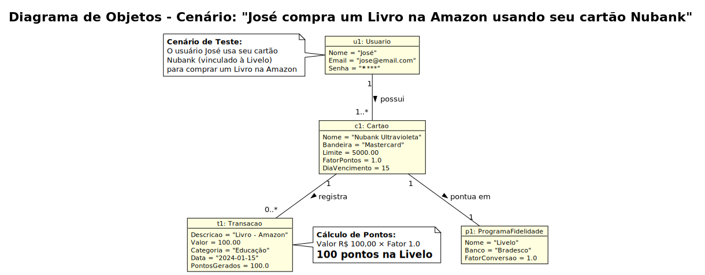

# Modelagem UML

Esta seção apresenta os diagramas da **Unified Modeling Language (UML)** desenvolvidos para o projeto.

## Diagrama de Casos de Uso

O diagrama de casos de uso ilustra as interações entre os atores e o sistema, refletindo o escopo funcional definido anteriormente.

A modelagem adotou as seguintes definições para a representação visual:

### Ator Principal (Primary Actor)

O **Usuário** é representado como o único ator do sistema.
Conforme a identificação de atores, ele é o responsável por alimentar a base de dados (transações e programas) e iniciar todos os fluxos de eventos presentes nos requisitos **RF-001** a **RF-009**.

#### Exclusão de Atores Secundários

O diagrama **não apresenta atores secundários** (como sistemas externos de envio de e-mail ou timers).
[cite_start]Esta decisão de modelagem deve-se à remoção de funcionalidades de automação passiva, como _“Notificações Push”_, do escopo deste **MVP**[cite: 55].
Dessa forma, não há interações ativas que justifiquem a representação de outros atores além do usuário final.

## Especificação de Casos de Uso (Fluxos de Eventos)

A seguir são detalhados os fluxos de interação para os casos de uso críticos do sistema, descrevendo o comportamento esperado nos cenários de sucesso (Caminho Feliz) e exceção.

### Especificação de Caso de Uso: Autenticar Usuário (Login)

**[CLIQUE AQUI PARA VER O UC-01](casos-de-uso/UC-01.md)**

### Especificação de Caso de Uso: Registrar Transação

**[CLIQUE AQUI PARA VER O UC-02](casos-de-uso/UC-02.md)**

### Especificação de Caso de Uso: Manter Cartões

**[CLIQUE AQUI PARA VER O UC-03](casos-de-uso/UC-03.md)**

### Especificação de Caso de Uso: Manter Programas

**[CLIQUE AQUI PARA VER O UC-04](casos-de-uso/UC-04.md)**

### Especificação de Caso de Uso: Manter Usuário (Perfil)

**[CLIQUE AQUI PARA VER O UC-05](casos-de-uso/UC-05.md)**

### Especificação de Caso de Uso: Visualizar Dashboard

**[CLIQUE AQUI PARA VER O UC-06](casos-de-uso/UC-06.md)**

### Especificação de Caso de Uso: Fazer Logout

**[CLIQUE AQUI PARA VER O UC-07](casos-de-uso/UC-07.md)**

### Casos de Uso Internos (Regras de Negócio)

_Estes casos descrevem processos internos reutilizáveis (Includes)._

**[CLIQUE AQUI PARA VER O UC-08 (Validar Dados)](casos-de-uso/UC-08.md)**
**[CLIQUE AQUI PARA VER O UC-09 (Calcular Pontos)](casos-de-uso/UC-09.md)**

## Diagrama de Objetos

O diagrama de objetos apresenta um **snapshot** (instante) do sistema em execução, mostrando objetos concretos e seus relacionamentos em um cenário real de uso. Este diagrama serve como validação do modelo de classes e como base para a criação dos dados de teste (seed data) no banco de dados.

### Cenário Representado

**"O usuário José usa seu cartão Nubank (vinculado à Livelo) para comprar um Livro na Amazon"**

Este cenário demonstra o fluxo completo de dados do sistema:

1. Um **Usuário** (José) possui um ou mais **Cartões** cadastrados
2. Cada **Cartão** está vinculado a um **Programa de Fidelidade** (Livelo)
3. As **Transações** de compra são registradas e associadas ao cartão utilizado
4. O sistema calcula automaticamente os **pontos gerados** com base no valor da transação e no fator de conversão

### Instâncias Representadas

#### u1: Usuario
- **Nome:** José
- **Email:** jose@email.com
- **Senha:** ******** (ocultada por segurança)

#### p1: ProgramaFidelidade
- **Nome:** Livelo
- **Banco:** Bradesco
- **FatorConversao:** 1.0

#### c1: Cartao
- **Nome:** Nubank Ultravioleta
- **Bandeira:** Mastercard
- **Limite:** R$ 5.000,00
- **FatorPontos:** 1.0
- **DiaVencimento:** 15

#### t1: Transacao
- **Descricao:** Livro - Amazon
- **Valor:** R$ 100,00
- **Categoria:** Educação
- **Data:** 15/01/2024
- **PontosGerados:** 100 pontos

### Relacionamentos (Links)

- **Usuario → Cartao:** Um usuário pode possuir um ou mais cartões (1..*)
- **Cartao → ProgramaFidelidade:** Cada cartão pontua em exatamente um programa de fidelidade (1)
- **Cartao → Transacao:** Um cartão pode ter zero ou mais transações registradas (0..*)

### Cálculo de Pontos Demonstrado

No exemplo apresentado:
- Valor da transação: **R$ 100,00**
- Fator do cartão: **1.0**
- **Pontos gerados: 100,00 × 1.0 = 100 pontos na Livelo**

Este diagrama valida que as classes definidas no modelo conseguem suportar um fluxo de dados completo e demonstra como os dados serão estruturados no sistema real.
